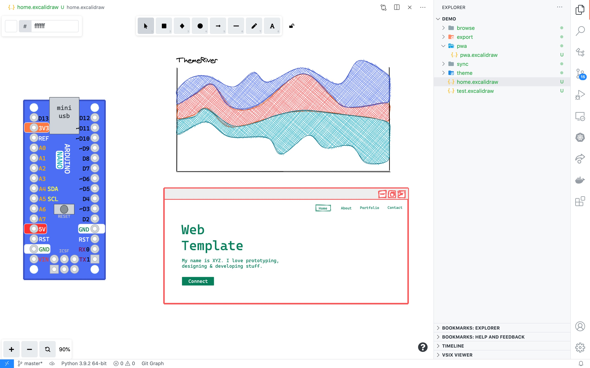
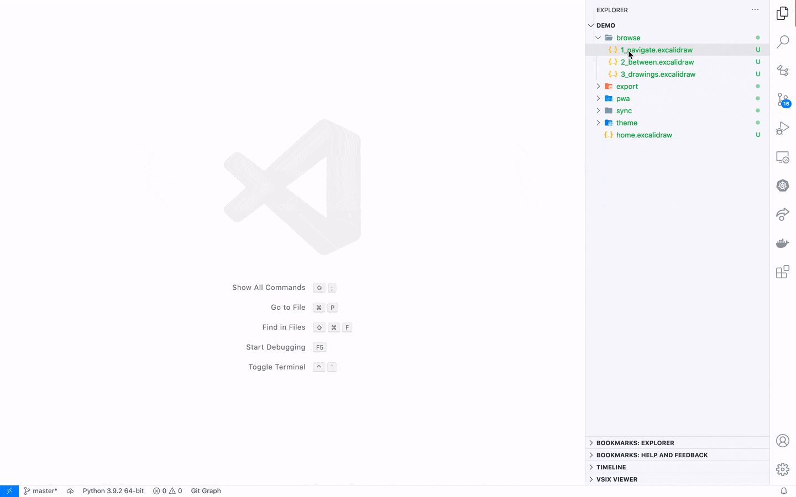
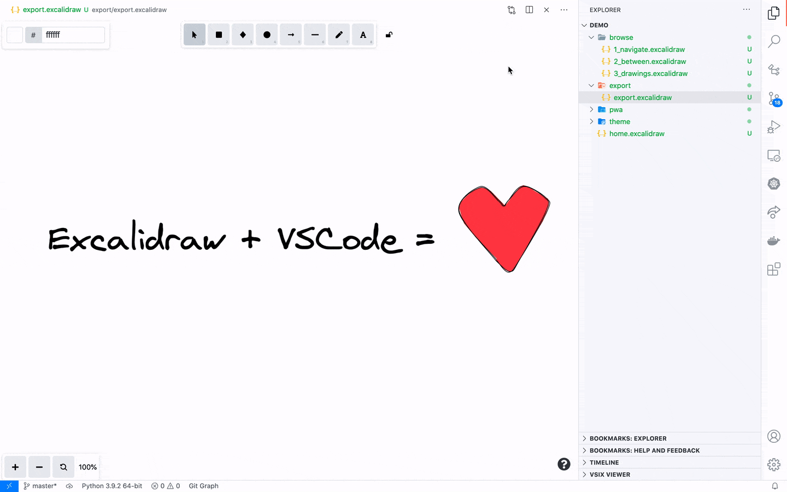
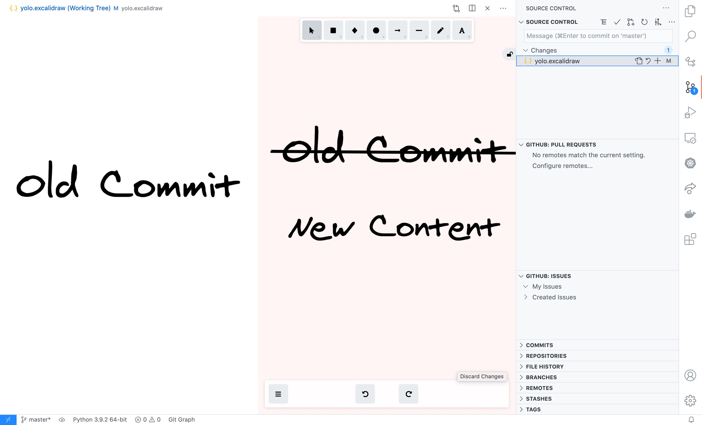
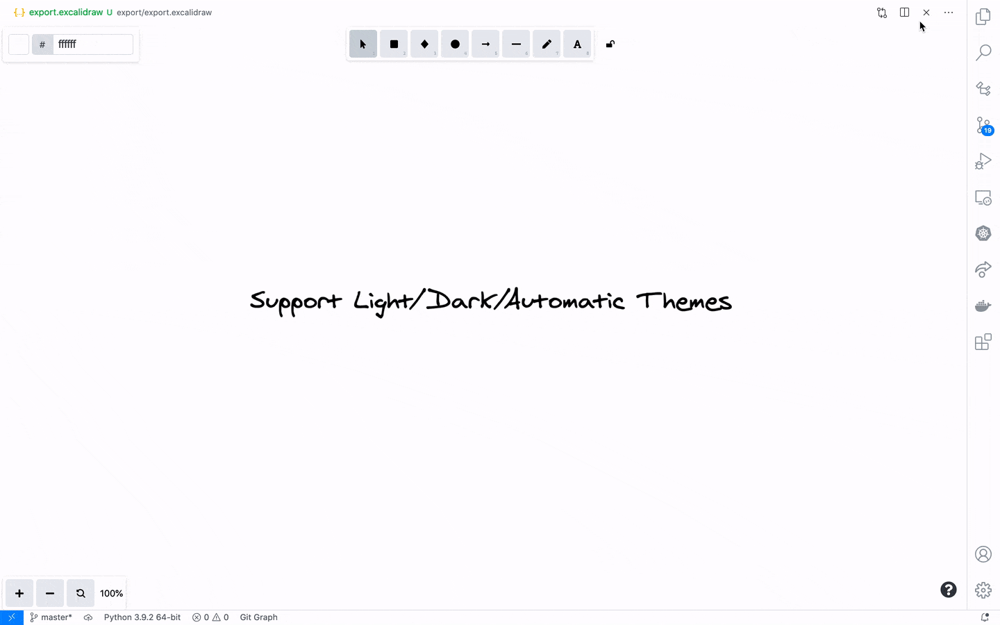
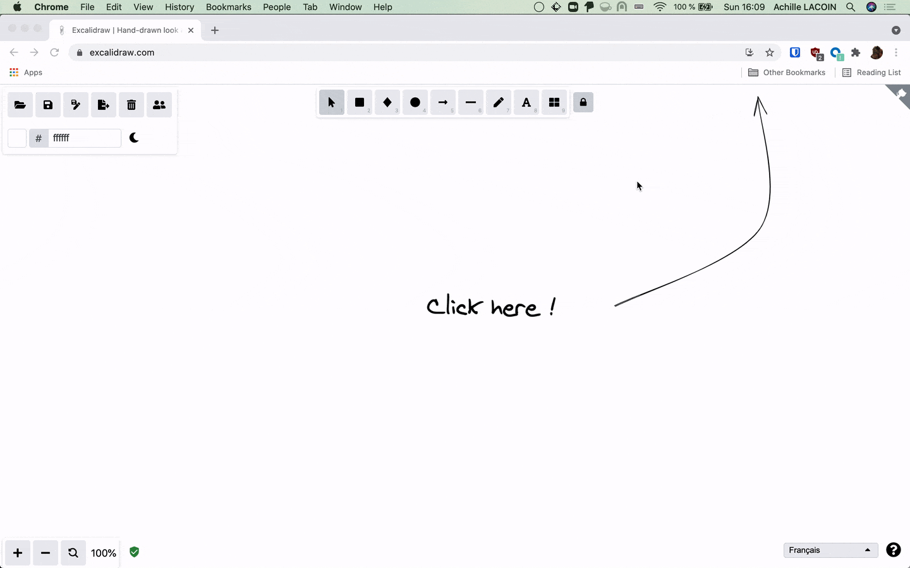

# Excalidraw VS Code Embed

This unofficial extension integrates Excalidraw into VS Code.

- [Excalidraw VS Code Embed](#excalidraw-vs-code-embed)
	- [Features](#features)
		- [Browse and edit your schemas directly in VS Code](#browse-and-edit-your-schemas-directly-in-vs-code)
		- [Two way sync between editors](#two-way-sync-between-editors)
		- [Export to png/svg](#export-to-pngsvg)
		- [Integration with Git](#integration-with-git)
		- [Automatic Dark/Light Theme](#automatic-darklight-theme)
		- [Switch between VS Code and Excalidraw PWA](#switch-between-vs-code-and-excalidraw-pwa)
	- [Missing Features](#missing-features)
	- [See Also / Credits](#see-also--credits)
	- [Similar Extensions](#similar-extensions)

## Features

### Browse and edit your schemas directly in VS Code

### Two way sync between editors

### Export to png/svg

Excalidraw Commands:
- `Excalidraw: Export to svg`
- `Excalidraw: Export to png`
- `Excalidraw: Export Options`

### Integration with Git

Quickly preview change between commits.

### Automatic Dark/Light Theme

`Exalidraw: Color Theme`

### Switch between VS Code and Excalidraw PWA

Use the `Excalidraw: Open in Application` command to edit your schema in Excalidraw PWA.

Instruction to install Excalidraw as a PWA :

## Missing Features

- Collaboration: The extension should work in Live Share, but the native excalidraw collaboration is not supported
- Export as Link: This requires a connexion to Excalidraw servers, this extension run locally
- Library support: I did not find a way to integrate it

## See Also / Credits

- [Excalidraw project](https://github.com/excalidraw/excalidraw): My favorite open source drawing app <3
- [Draw.io VS Code integration](https://marketplace.visualstudio.com/items?itemName=hediet.vscode-drawio): Huge source of inspiration, go checkout @hediet work !
- [Roam Excalidraw](https://roam-excalidraw.com/): Existing integration in Roam Research, another source of inspiration
- [Marp](https://marketplace.visualstudio.com/items?itemName=marp-team.marp-vscode): this extension was built to be able to easily integrate schemas to my marp slides

## Similar Extensions

There are already excalidraw extensions in vscode, but none of them use the excalidraw npm package.
It should be quicker to integrate new features using the officialy provided component !

- [Excalidraw Integration](https://marketplace.visualstudio.com/items?itemName=brijeshb42.vscode-excalidraw)
- [Excalidraw VSCode Plugin](https://marketplace.visualstudio.com/items?itemName=jkchao.vscode-excalidraw-plugin)
