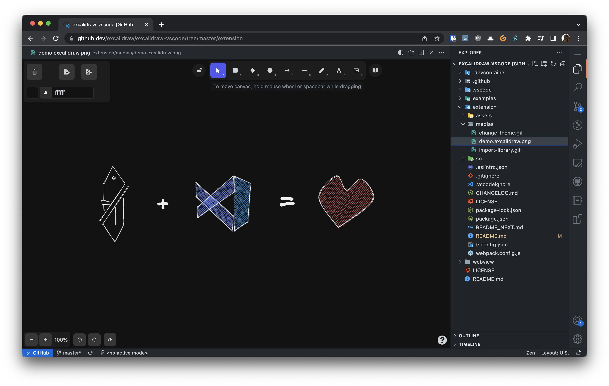

# Excalidraw

This extension integrates Excalidraw into VS Code.
To use it, create an empty file with a `.excalidraw`, `.excalidraw.json`, `.excalidraw.svg` or `excalidraw.png` extension and open it in VSCode.

Try the web version at : <https://excalidraw.com/>



## Configuration

### Switch Excalidraw Theme


### Import Public Library


### Switch between multiple file formats

Update the document extension to the desired format. For example, `document.excalidraw` -> `document.excalidraw.png`.

### Associate Additional Extensions With the Excalidraw Editor

By default, this extension only handles `*.excalidraw`, `*.excalidraw.svg` and `*.excalidraw.png` files.

Add this to your VS Code settings.json file if you want to associate it with additional file extensions (ex: SVG):

```json
{
  "workbench.editorAssociations": {
    "*.svg": "editor.excalidraw"
  }
}
```

You won't be able to edit arbitrary SVG files though - only those that have been created with Excalidraw or this extension!

### Sharing your Library

If you want to use a workspace specific library (and share it with other contributors), add this to your vscode workspace settings file (`.vscode/settings.json`):

```json
{
  "excalidraw.workspaceLibraryPath": "path/to/library.excalidrawlib"
}
```

The workspaceLibraryPath path is relative to your workspace root.
